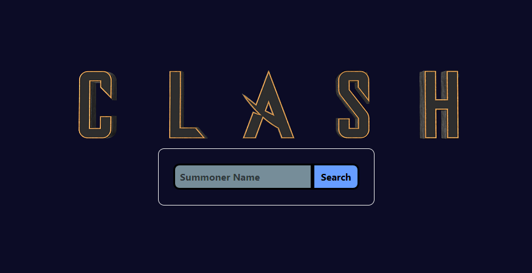

# League-of-Legends-Clash-Stats

### Site
https://clash.tips/

### Setup
1. Clone repo
1. Run `npm install`
1. Create a `.env` file with `API_KEY=your_riot_api_key_here`
1. Run with `npm run dev`
1. Open [http://localhost:3000](http://localhost:3000) with your browser to see the result.

### Editing
1. This project uses Next.js, modify `pages/` to modify visuals
1. Modify `lib/` to modify data
